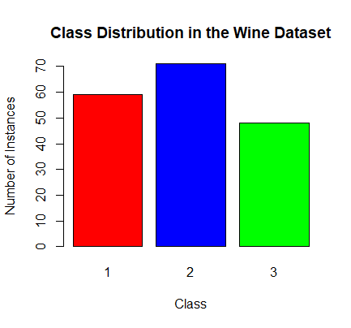
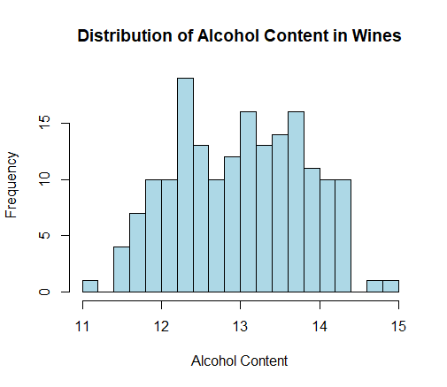
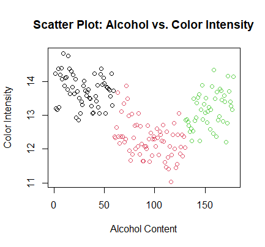
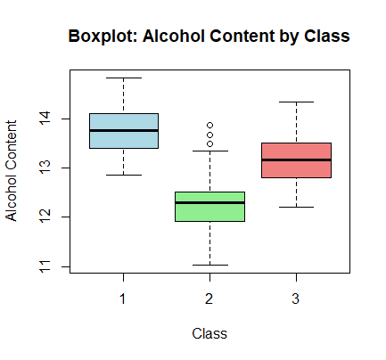

# Tree-Classification-model

## Chapter 1: Importing the Data
In the initial phase of this project, we begin by importing the dataset. The dataset is retrieved from the UCI Machine Learning Repository and consists of information about different types of wine. We use the read.table function to load the data, specifying the data source, separator, column names, and other relevant parameters. After loading the data, we examine its dimensions, check for missing values, and generate a summary to gain an initial understanding of its structure and content. \
Source: [UC Irvine Machine Learning Repository](https://archive.ics.uci.edu/)

In this chapter, we establish the foundation of our analysis by obtaining and preparing the dataset for further exploration and modeling.

## Chapter 2: Dataset Overview:
### Features: 
The dataset includes features like: \
Class: This feature represents the class or type of wine. It serves as the target variable in this dataset, with values indicating different wine classes. \
Alcohol: Alcohol content is the percentage of alcohol present in the wine. It can influence the flavor and strength of the wine. \
Malic Acid: Malic acid is a type of organic acid found in grapes. It contributes to the overall acidity of the wine. \
Ash: Ash content refers to the inorganic mineral content present in the wine. It can affect the taste and stability of the wine. \
Alcalinity of Ash: This measures the alkalinity of the inorganic components in the wine. It is an important factor in wine chemistry. \
Magnesium: Magnesium content represents the concentration of magnesium in the wine. It can impact the wine's taste and aroma. \ 
Total Phenols: Total phenolic content measures the concentration of phenolic compounds in the wine. Phenols can contribute to the wine's color, flavor, and antioxidant properties. \
Flavanoids: Flavonoids are a subgroup of phenolic compounds found in wine. They play a significant role in wine quality, taste, and health benefits. \
Nonflavanoid Phenols: This feature represents the concentration of non-flavonoid phenolic compounds in the wine, which can also influence wine characteristics. \
Proanthocyanins: Proanthocyanins are a type of flavonoid found in wine. They contribute to the wine's bitterness and astringency. \
Color Intensity: Color intensity measures the depth and richness of the wine's color. It is an important visual characteristic of wine. \
Hue: Hue refers to the color shade of the wine. It can provide insights into the wine's color variation. \
OD280/OD315 of Diluted Wines: This feature represents the optical density of wines measured at two different wavelengths. It can be related to the wine's color and clarity. \
Proline: Proline is an amino acid found in wine. It can affect the wine's taste, aroma, and stability.

### Target Variable:
The target variable in this project is: \
Class: It determines whether the classified wine of class 1, 2 or 3.

## Chapter 2: Exploratory Data Analysis (EDA)
Exploratory Data Analysis (EDA) is a critical step in understanding the dataset's characteristics and relationships between variables. In this chapter, we employ various visualizations and statistics to delve into the Wine dataset.

### Visualizations:
### Class Distribution
The first visualization explores the distribution of classes in the Wine dataset. A barplot is used to represent the number of instances for each class (Class 1, Class 2, and Class 3) in different colors (red, blue, and green). This plot provides insights into the distribution of wine classes within the dataset. \

### Alcohol Content Distribution
The second visualization focuses on the distribution of alcohol content in the wines. A histogram is used to display the frequency of different alcohol content values. The plot is color-coded with a light blue fill and black borders and is divided into 20 bins to show the spread of alcohol content. \

### Scatter Plot: Alcohol vs. Color Intensity
The third visualization presents a scatter plot that examines the relationship between alcohol content and color intensity. Each data point is color-coded according to its wine class. This plot helps us visualize how alcohol content relates to color intensity across different wine classes. \

### Boxplot: Alcohol Content by Class
The fourth visualization employs a boxplot to showcase the distribution of alcohol content within each wine class. The boxplot provides insights into the median, quartiles, and potential outliers of alcohol content for each class. Different classes are represented in distinct colors. \
 \
These visualizations are instrumental in uncovering patterns, distributions, and relationships within the Wine dataset, setting the stage for subsequent modeling and analysis. They offer a visual narrative of the dataset's characteristics, helping us make informed decisions about feature selection and modeling strategies. \
In this chapter, we gained a deeper understanding of the dataset's properties, which will inform our modeling decisions.

## Chapter 3: Building the Model
This chapter revolves around constructing a predictive model using the dataset. We start by preparing the dataset for modeling, specifically focusing on the target variable. In this case, the 'Class' variable, representing different wine classes, is converted into a factor.

Next, we introduce the decision tree model, a popular choice for classification tasks. We utilize the tree package to build an initial decision tree model. The model's structure is visualized to provide a high-level overview.

## Chapter 4: Model Evaluation
With the model constructed, we move on to evaluating its performance. Initially, the model is trained on a subset of the dataset. We use a random seed to ensure reproducibility and obtain a training set of 150 instances.

The decision tree model is trained on the training set, and predictions are made on the test set. The results are then compared to the actual class labels, allowing us to calculate performance metrics.

## Chapter 5: Model Pruning and Refinement
In this chapter, we address model complexity and overfitting by performing pruning on the decision tree. The decision tree model is initially built without constraints, which may lead to overly complex structures that do not generalize well to new data. Pruning aims to simplify the tree while maintaining predictive accuracy.

We use cross-validation to determine the optimal level of pruning. Cross-validation helps us find the right trade-off between model complexity and performance.

Once the optimal pruning level is determined, we prune the decision tree accordingly. The pruned tree is visualized and evaluated to assess its performance compared to the unpruned version.

## Chapter 6: Conclusion and Model Assessment
In the final chapter, we conclude the project by summarizing our findings and model assessment. We have successfully imported and explored the dataset, built a decision tree model, evaluated its performance, and refined it through pruning. The pruned model provides better generalization and improved predictive accuracy. We emphasize the importance of model assessment and selection, which are critical aspects of any machine learning project. This project serves as a practical example of classification modeling and the iterative process of refining models for better performance and interpretability.
